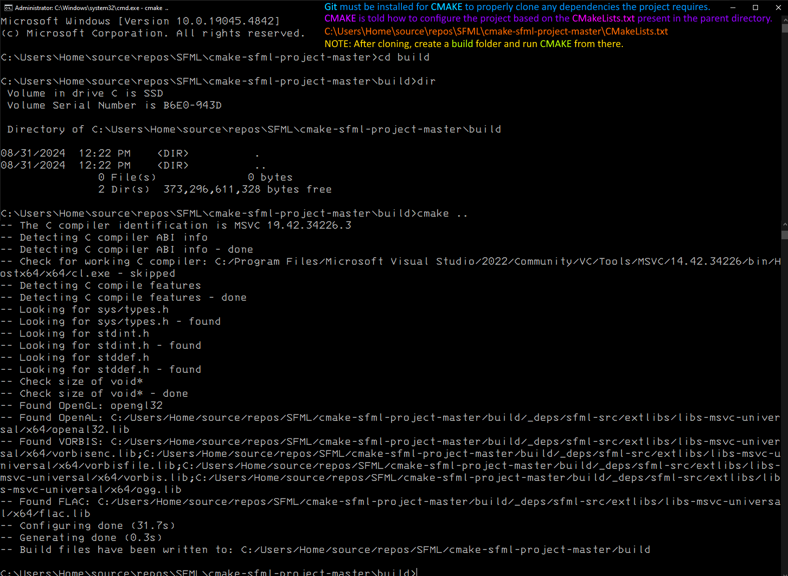

## Windows 95/98 Starfield Simulation Screensaver (using 2024 technology)

- Based on the [CMake SFML Project Template](https://github.com/SFML/cmake-sfml-project) using ISO C++ v17.

---

- Portions of my version are based on Pezzza's video: [How to do Rendering using C++ from ZERO](https://www.youtube.com/watch?v=t0z3RojiKFg)

### Screensaver running:


- To install, just rename `main.exe` to `stars.scr` and copy it (and `star.png`) to your `C:\Windows\System32` folder.
- I've left the asset as an external PNG so you can replace it with your own, if you prefer.
- **PageUp** will speed up the simulation, **PageDown** will slow it down.

### Image asset:


---

## How to Compile

1. Install [Git](https://git-scm.com/download/win) and [CMake](https://cmake.org/download). Use your system's package manager if available.
1. Follow the above instructions about how to use GitHub's project template feature to create your own project.
1. Clone your new GitHub repo and open the repo in your text editor of choice.
1. Open [CMakeLists.txt](CMakeLists.txt). Rename the project and the executable to whatever name you want.
1. If you want to add or remove any .cpp files, change the source files listed in the `add_executable(...)` call in CMakeLists.txt to match the source files your project requires. If you plan on keeping the default main.cpp file then no changes are required.
1. Configure and build your project. Most popular IDEs support CMake projects with very little effort on your part.
    - [VS Code](https://code.visualstudio.com) via the [CMake extension](https://code.visualstudio.com/docs/cpp/cmake-linux)
    - [Visual Studio](https://docs.microsoft.com/en-us/cpp/build/cmake-projects-in-visual-studio?view=msvc-170)
    - [CLion](https://www.jetbrains.com/clion/features/cmake-support.html)
    - [Qt Creator](https://doc.qt.io/qtcreator/creator-project-cmake.html)

    Using CMake from the command line is straightforward as well.
    Be sure to run these commands in the root directory of the project you just created.

    ```
    cmake -B build
    cmake --build build
    ```

---

### CMake from CLI instructions:

- After cloning [the SFML repo](https://github.com/SFML/cmake-sfml-project/archive/refs/heads/master.zip) from github, open a command prompt in the folder:



- You can then open the **Visual Studio** `sln` file that **cmake** created and use the IDE from that point forward.
